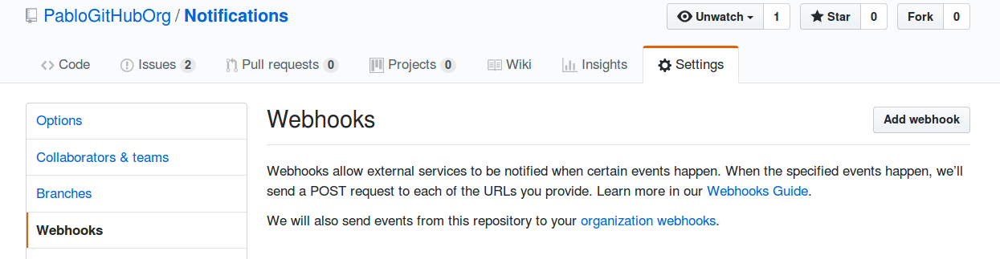

# Notifications
This repository contains the source code for a web service that works with GitHub webhooks.

It detects when a repository inside a GitHub organization has been deleted and opens an issue in another repository to notify about it.

Check [issues](https://github.com/PabloGitHubOrg/Notifications/issues) to see it working.

## How does it work

It uses Docker to run a webserver and requests a [Let's Encrypt](http://letsencrypt.org/) automatically
for your domain.

The web service is written in [Flask](http://flask.pocoo.org/).

# Instructions

## Obtain your Personal access token

You need to get a [Personal access token](https://github.com/settings/tokens) for your GitHub user.

Since we want to create issues, make sure the token has permissions in the 'public_repo' scope.

Write down your token, you will need it later.

## Configure your Organization webhook

Go to your Organization settings page, find the Webhooks section and fill the required
information to add your webhook.

| Setting      | Comment                                                      |
|--------------|--------------------------------------------------------------|
| Payload URL  | Use a domain here, do not use an IP, e.g. `https://webhooks-github.pablog.me/postreceive` |
| Content-type | Choose `application/json`                                    |
| Secret       | A random string, like `e3ace7ce-7b9e-11e8-b8ef-639aee8a6050` |
| Webhook events | Select the individual event **Repositories**               |

## Install

In order to run the web service, all you need a machine reachable from the Internets and Docker.

It has been tested to work in Ubuntu 16.04 x64.

First, clone the repository in that machine and adjust the variables.env file with your desired configuration.

    git clone https://github.com/PabloGitHubOrg/Notifications.git
    cd Notifications

    cp variables.env.example variables.env
    # Edit variables.env

Here is a description of each variable:

| Variable     | Description                                  | Example                                                    |
|--------------|----------------------------------------------|------------------------------------------------------------|
| NOTIFY_REPO  | Repository where the issues will be created  | `PabloGitHubOrg/Notifications`                             |
| NOTIFY_USER  | Username that will be notified in the issues | `PabloCastellano`                                          |
| API_TOKEN    | Your Personal access token                   | `918520ec485f9784bf81a93b52ea24674fb4d9be`                 |
| SECRET_TOKEN | The random string you have previously configured for the webhook | `e3ace7ce-7b9e-11e8-b8ef-639aee8a6050` |
| VIRTUAL_HOST | Hostname that will point to the web service     | `webhooks-github.pablog.me`                             |
| LETSENCRYPT_HOST | Hostname that will point to the web service | `webhooks-github.pablog.me`                             |
| LETSENCRYPT_EMAIL | Your email address                         | `user@example.com`                                      |

## Run

A script is provided to easily install the Docker dependencies:

    ./install_docker.sh

Docker does the rest of the magic:

    docker-compose build
    docker-compose up -d
    docker-compose logs -f

Now you can test it by creating and removing a repository in your GitHub organization.
